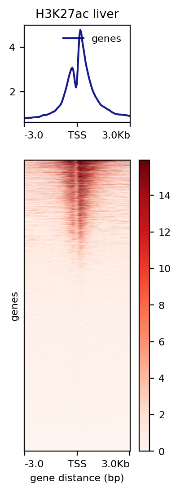
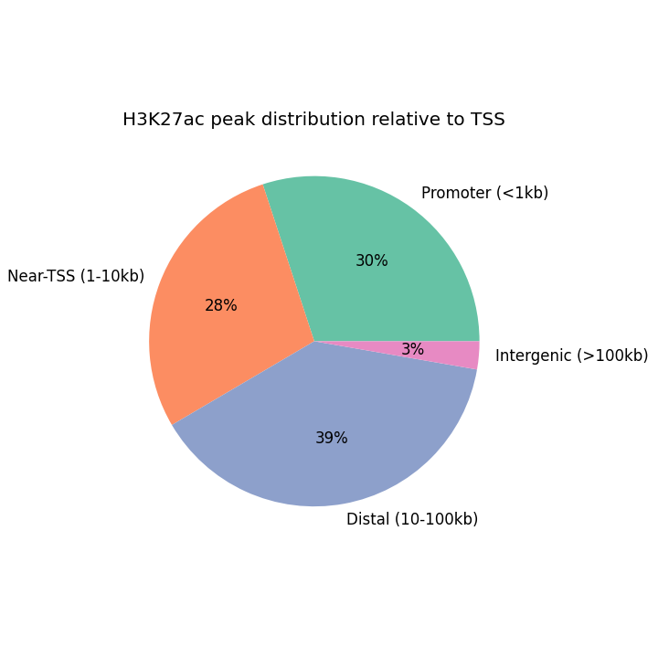
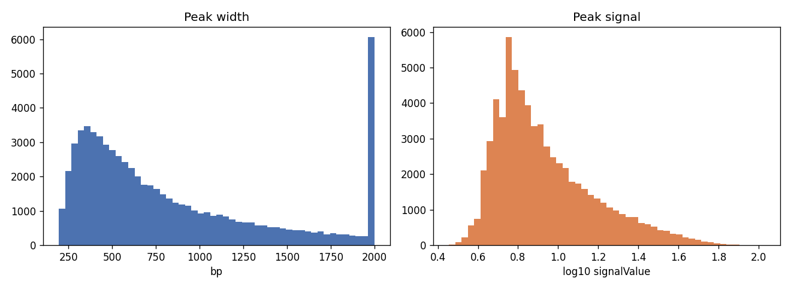

# ChIP-seq: H3K27ac regulatory landscape in primary human liver

A downstream ChIP-seq analysis on public **ENCODE** data for **primary human liver tissue** (donor
liver, not a cell line). H3K27ac marks active promoters and enhancers, so this maps the active
regulatory landscape of the liver — where the genome is "switched on." Done two ways: Python
(Colab-ready) and R, since both are part of my workflow.

## Data

ENCODE Project — H3K27ac Histone ChIP-seq on **human liver tissue** (GRCh38), pulled directly from the
ENCODE portal API (no login). The notebook auto-discovers a released human-liver experiment that has
both a peak file and a signal track, so it stays reproducible.

> ENCODE Project Consortium. *An integrated encyclopedia of DNA elements in the human genome.*
> Nature 489, 57–74 (2012). https://www.encodeproject.org

## The story / what the results show

**H3K27ac piles up right at active promoters.** The TSS-enrichment heatmap and profile show the
classic H3K27ac shape — a sharp, slightly bimodal signal flanking the transcription start site (the
TSS itself sits in a nucleosome-depleted gap, with the flanking nucleosomes acetylated). This is the
signature of genes that are actively transcribed in liver.

**Binding is split between promoters and distal enhancers.** Classifying every peak by its distance to
the nearest gene shows H3K27ac isn't only at promoters — a large share sits in distal regions, i.e.
liver enhancers acting on genes from a distance.

**Peak statistics** (width and signal strength) confirm a clean, high-signal dataset:

**Genes with the strongest promoter activity** ([`results/top_promoter_genes.csv`](results/top_promoter_genes.csv))
include active/housekeeping and metabolism-related genes (e.g. DUSP16, HSPE1, PNRC1, GOLPH3, SLC7A2,
USP22) — consistent with an actively transcribed liver program.

## Files

- `chipseq_analysis.ipynb` — Python analysis (deepTools, pybedtools); runs top-to-bottom on Colab.
- `chipseq_annotation.R` — ChIPseeker feature annotation + clusterProfiler GO enrichment.
- `results/` — figures and tables.

## How to run

1. Open `chipseq_analysis.ipynb` in Google Colab → **Run all** (~5–10 min). Figures land in `results/`.
2. (Optional) run `chipseq_annotation.R` in R/RStudio on the same `peaks.bed` for the ChIPseeker/GO figures.

To profile a different mark or factor (e.g. H3K4me3 for promoters, CTCF for insulators), change
`target.label` in the ENCODE query cell.
