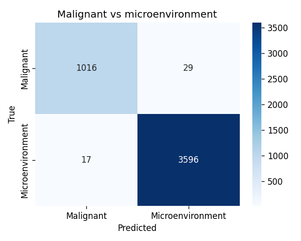
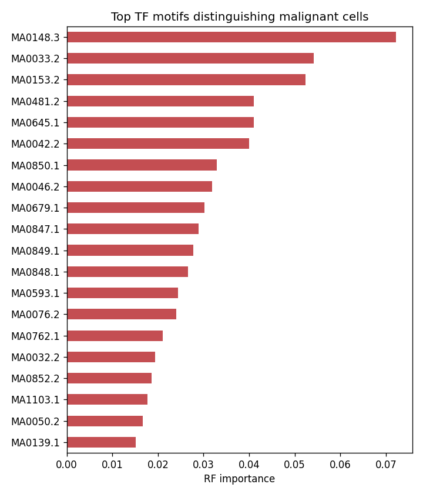

# Single-cell ATAC-seq in liver cancer: are malignant cells epigenetically distinct?

Single-cell ATAC-seq measures *open (accessible) chromatin* — the regulatory regions switched on in
each cell. This project analyzes primary liver cancer scATAC data with a focused **ML question**:

> Can a model separate **malignant** cells from the normal **tumor-microenvironment** cells using only
> their transcription-factor (TF) motif accessibility — and if so, *which TFs* carry that signal?

Instead of reprocessing the study's 14.5 GB of raw fragments (infeasible on Colab free tier), it uses
the deposited **per-cell TF-motif activity matrices** (chromVAR-style), so it runs quickly. The ML is
doing real work — separating tumor cells from their microenvironment and surfacing the regulators
behind it.

## Data

Craig et al., *Cell Reports* 2023 — scATAC-seq of primary liver cancer (HCC + intrahepatic
cholangiocarcinoma), **GEO GSE227265** (16 patients, **18,631 cells**). Uses the processed
supplementary matrices `GSE227265_TFMotifActivity.csv.gz` (all cells) and
`GSE227265_TFMotifActivityMalignantCells.csv.gz` (malignant-cell barcodes, for labels).

> Craig AJ, Silveira MAD, Ma L, et al. *Genome-wide profiling of transcription factor activity in
> primary liver cancer using single-cell ATAC sequencing.* Cell Reports 42, 113446 (2023).
> https://doi.org/10.1016/j.celrep.2023.113446

## Results

**Malignant cells are cleanly separable from the microenvironment by chromatin accessibility alone.**
A Random Forest trained on per-cell TF-motif activity (4,180 malignant vs. 14,451 microenvironment
cells) reaches **~0.99 accuracy** and **0.986 macro-F1** on a held-out test set — only 46 of 4,658 test
cells misclassified, with malignant recall ~97% and precision ~98%. This is real signal, not leakage:
tumor (epithelial) and immune/stromal cells genuinely have very different open chromatin, and all
features come from one uniformly-computed matrix (the malignant file is used only to assign labels).

**The TFs driving the split are the liver lineage-identity program.** The most predictive motifs are
led by **FOXA1** (MA0148.3, a hepatocyte pioneer factor) and are dominated by **forkhead (FOX)** and
**hepatocyte nuclear factor (HNF1, ONECUT/HNF6)** motifs, alongside **ETS-family** motifs — the
lineage-defining regulators the original study highlighted for hepatocytic vs. cholangiocytic tumors.
So the classifier isn't keying on an artifact; it recovers the known biology. Full ranked list:
[`results/top_TF_importances.csv`](results/top_TF_importances.csv).

## Methods

Load per-cell TF-motif activity → label cells malignant vs. microenvironment (malignant barcodes from
the deposited malignant-cell file; separators normalized to match) → **Random Forest classifier**
(class-balanced, stratified split, cross-validated, confusion matrix) → **feature importance** ranks
the TF motifs distinguishing malignant cells, checked against the FOX/HNF and ETS families.

## Files

- `scatac_analysis.ipynb` — the full analysis; runs top-to-bottom on Colab.
- `results/confusion_matrix.png`, `results/top_TF_motifs.png`, `results/top_TF_importances.csv`

## How to run

Open `scatac_analysis.ipynb` in Google Colab → **Run all**. Figures land in `results/`.

*Design note: the raw fragments for this study are a single 14.5 GB file, so this project deliberately
uses the study's processed TF-motif-activity matrices — much lighter and directly suited to the ML
question.*
