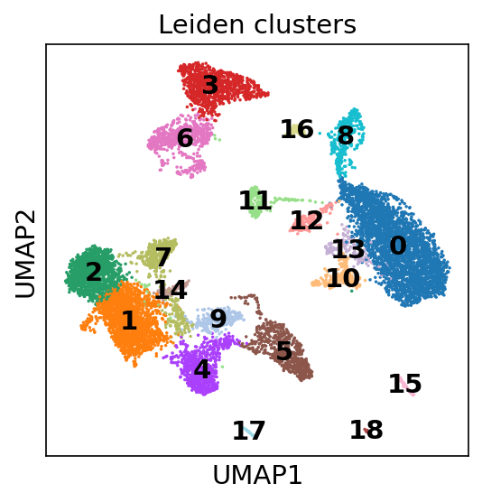
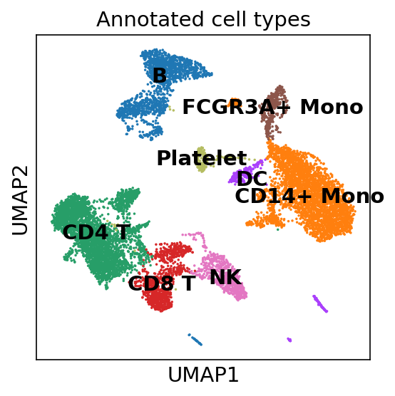
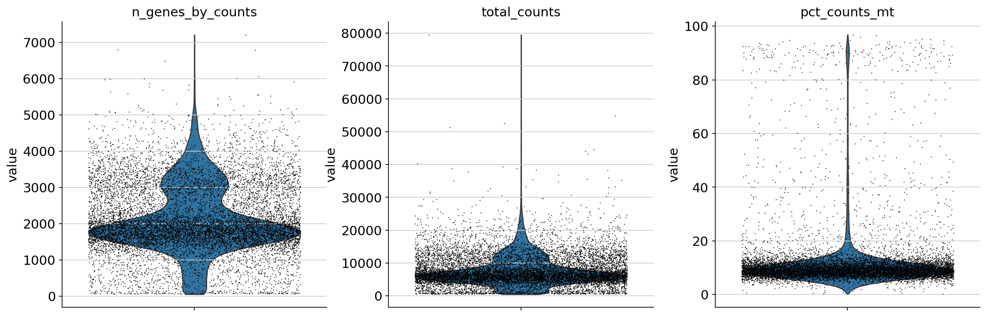
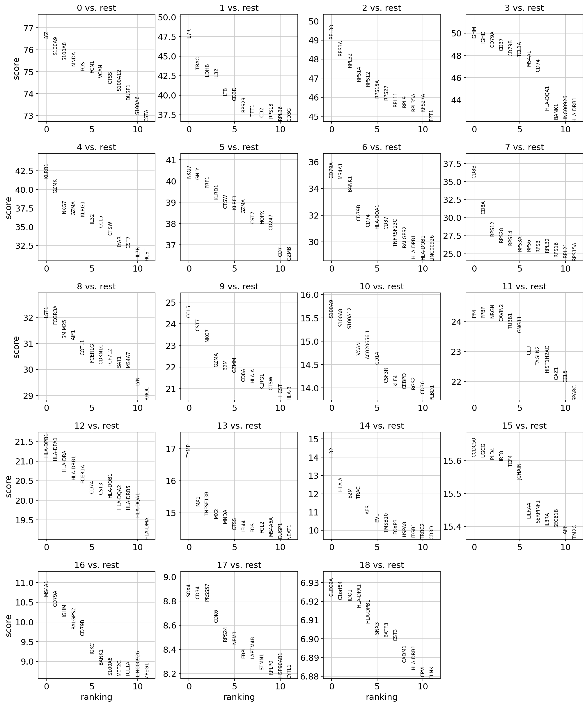
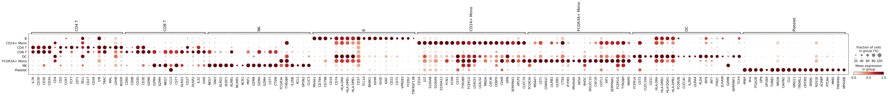
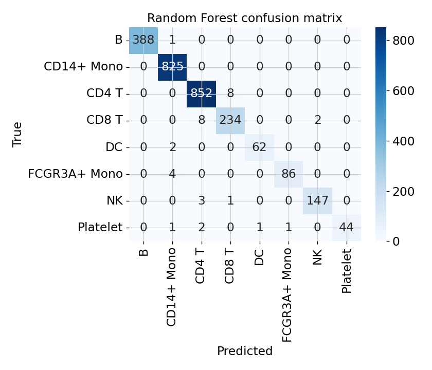
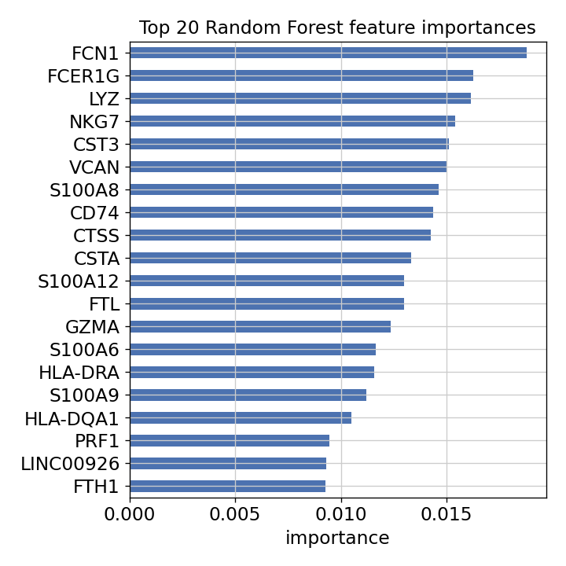

# Results

Generated by running `scrna_analysis.ipynb` on the 10x Genomics 10k PBMC v3 dataset.
Exact numbers are in [`results/metrics.txt`](results/metrics.txt).

## Clustering & annotation

Leiden clustering of ~11k PBMCs, annotated into the major immune lineages from marker panels.

| Leiden clusters | Annotated cell types (UMAP) |
|---|---|
|  |  |

## Quality control

## Marker genes

Top cluster markers (Wilcoxon) and reference-panel expression across annotated types:

| Ranked markers | Marker dot plot |
|---|---|
|  |  |

Per-type significant markers (BH-adjusted p < 0.05): [`results/marker_significance.csv`](results/marker_significance.csv).

## Classification

Random Forest and MLP predict cell type from HVG expression (stratified 75/25 split).

| Confusion matrix (RF) | Top feature importances |
|---|---|
|  |  |

Full per-class metrics: [`results/classification_report.txt`](results/classification_report.txt).

### Headline metrics

10,685 cells · 20,292 genes · 19 Leiden clusters · 8 annotated cell types.

| Model | Accuracy | Macro-F1 |
|---|---|---|
| Random Forest | 0.987 | 0.977 |
| MLP | 0.986 | 0.980 |
| Random Forest (5-fold CV) | 0.984 ± 0.004 | — |

Every cell type scores F1 ≥ 0.95 (see `results/classification_report.txt`). Top feature importances
align with the annotation markers (CD3D, MS4A1, NKG7, LYZ, FCGR3A), confirming the classifier learned
real biological signal rather than a technical artifact.
