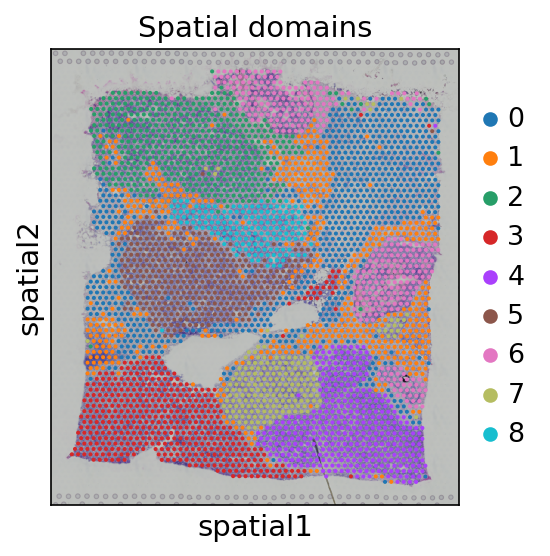
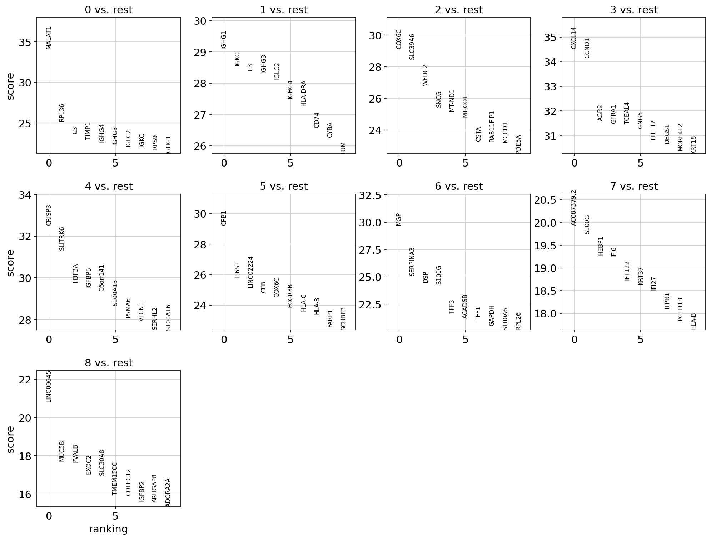
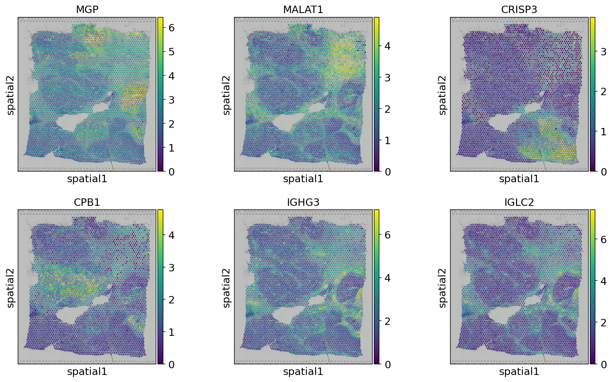
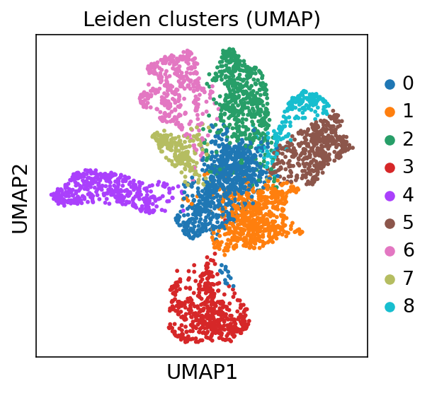
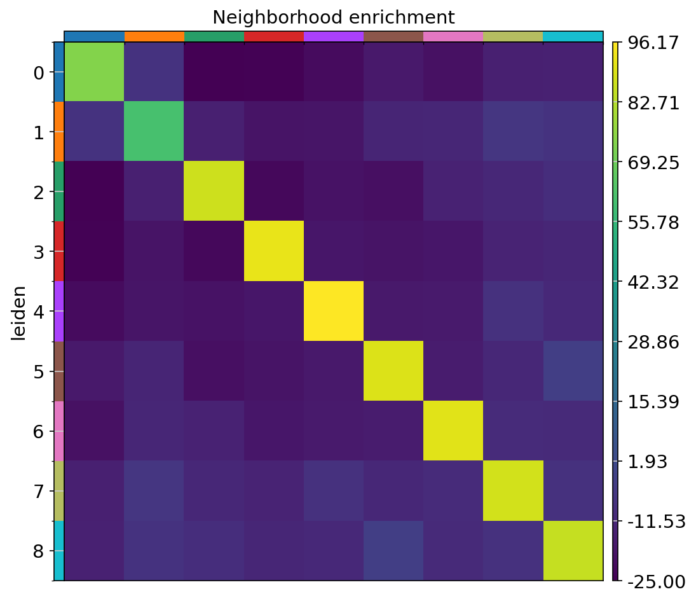

# Spatial transcriptomics: clustering & spatial gene patterns (10x Visium)

An end-to-end 10x Visium spatial-transcriptomics analysis on a public human cancer section. It runs
QC, clusters the spots into spatial domains, maps them back onto the tissue, finds each domain's marker
genes, and uses **squidpy** to pull out spatially variable genes and neighborhood structure. The point
is to recover tissue architecture — tumor, stroma, immune — straight from expression + spatial position.

Runs top-to-bottom on Google Colab; the data downloads in one line via scanpy.

## Data

10x Genomics public Visium — **Human Breast Cancer** (Block A, Section 1), Space Ranger 1.1.0, loaded
with `scanpy.datasets.visium_sge()`. The pipeline is tissue-agnostic — swap `sample_id` (or point at a
GEO HCC Visium section) to run it on liver.

## The story / what the results show

**The section resolves into distinct spatial domains.** Leiden clustering on the spots gives regions
that line up with the tissue image, not a random scatter — the hallmark of real spatial structure
(tumor nests vs. surrounding stroma vs. immune areas).

**Each domain has its own marker genes** (Wilcoxon), which is how you'd assign biological identities
(epithelial/tumor, fibroblast/stroma, immune):

**Spatially variable genes tell the biological story.** The genes with the highest Moran's I
([`results/spatially_variable_genes.csv`](results/spatially_variable_genes.csv)) are strongly
spatially organized: immunoglobulin genes (IGHG3, IGLC2, IGKC — plasma-cell / immune infiltrate),
secretory/stromal genes (MGP, CPB1, CRISP3), and interferon/HLA genes (IFI27, HLA-A) marking immune
regions. Plotted on tissue, they light up specific compartments:

**The same domains separate in UMAP space** — clusters are distinct in expression space too, so they
reflect real populations, not just spatial smoothing:

**Neighborhood enrichment** shows which domains sit next to each other more than expected — the spatial
adjacency map of the tissue:

(Spot QC metrics are in [`results/qc_metrics.png`](results/qc_metrics.png).)

## Files

- `spatial_analysis.ipynb` — the full analysis; runs on Colab.
- `results/` — figures and tables.

## How to run

Open `spatial_analysis.ipynb` in Google Colab → run the install cell → **Runtime → Restart session** →
run the rest (**Run all**). ~5–10 min. Figures land in `results/`.
